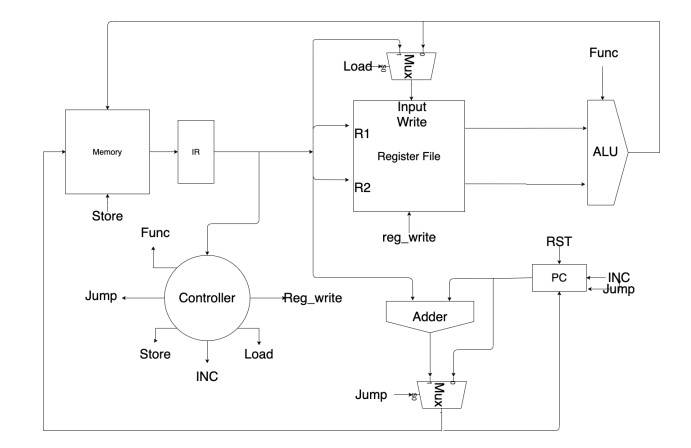
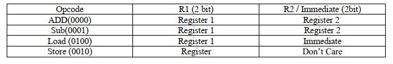
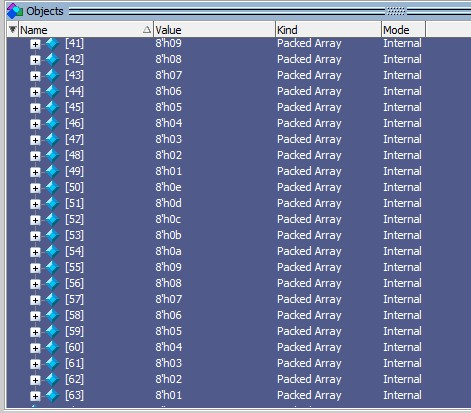

# Sample-CPU
Design Sample CPU in Digital System Test and Testable Design course

The CPU performs 5 operations of adding, subtracting, jumping and storing a register in memory and loading a value in a register.

All CPU commands, registers and memory cells are 8-bit.

The structure of the command is such that 4 high-value bits are the first operator. The 4 low-value bits in different commands can include the register number, the numeric value to be loaded in the register, or the address to which the processor must jump.

Add R1,R0 --> R1 = R1 + R0 

Sub R1,R0 --> R1 = R1 - R0

Load R1,2 --> R1 = 2

Store R1  --> Memory[predefined] = R1

Jump 10  --> PC = PC + 10

Application memory:

As mentioned, the addresses of this system are also 8-bit. This means that the memory of this system has 64 8-bit cells. This memory can be a two-dimensional array of reg in Verillag language. To initialize this array, you can save the desired values ​​in a txt file and enter the desired values ​​in the array with the following command.

              $readmemb("initial_memory.txt",memory_array);
        
Memory cells 0 to 31 are used for command memory and cells 32 to 63 are used for data memory.

Our TestBench stores values at the end of the memory.

This processor is simulated in Verillag hardware description language and in ModelSim SE version 10.5 

TestBench report in CodeCoverage.txt 
